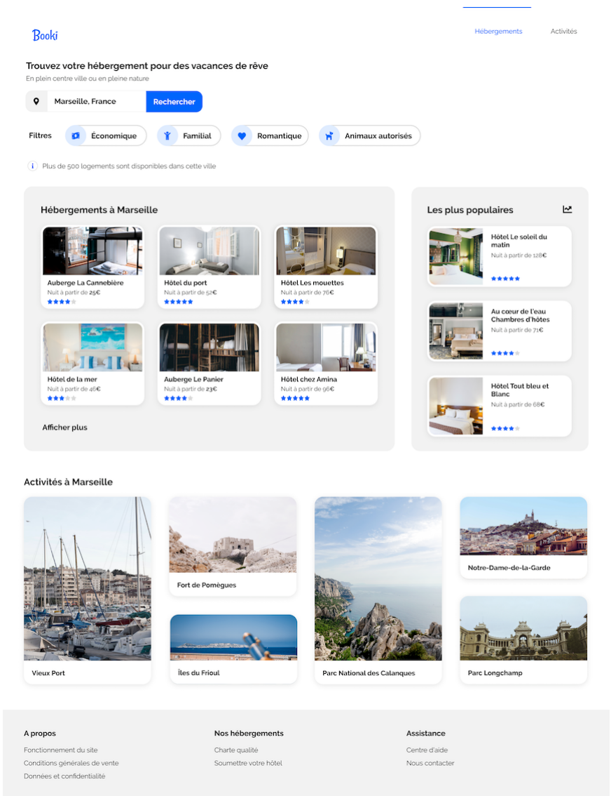

# BOOKI

## Projet 2 du parcours Développeur Web d'Openclassrooms.

## Objectifs

- Intégration des maquettes de design en HTML / CSS selon un template fourni.
- Appliquer la logique desktop first puis la version tablette et enfin la version mobile.
- Publier le résultat sur GitHub Pages.

## GitHub Pages

Site accessible à cette adresse : [mister2dev.github.io/reservia/](https://mister2dev.github.io/reservia/ "https://mister2dev.github.io/reservia/")

## Livrables :

-   Lien vers le repository GitHub
-   Lien vers la page web hébergée sur GitHub Pages
